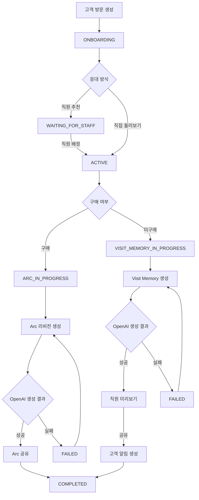
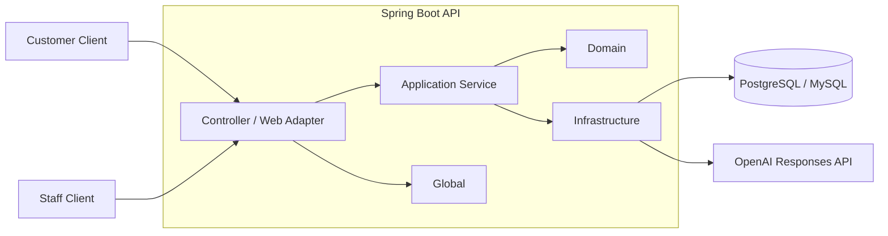
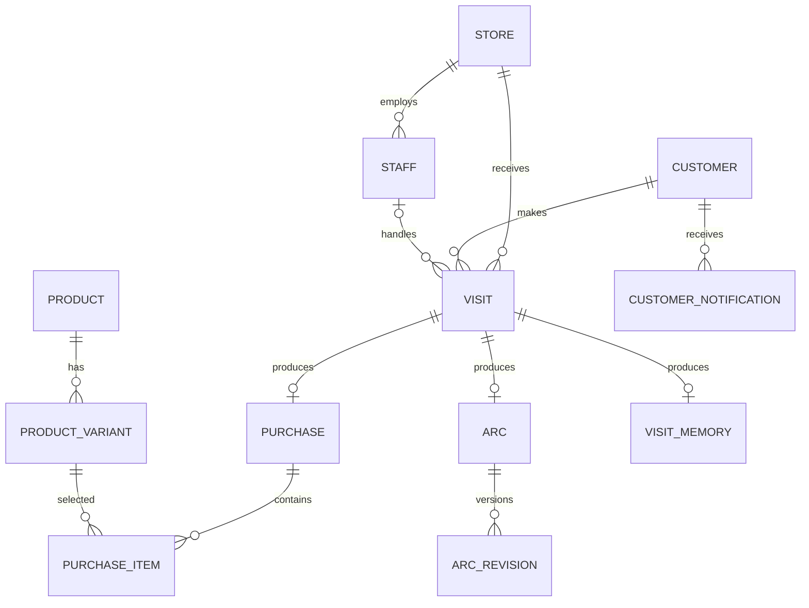

# MCM Orbit Backend

[](https://github.com/TEAM-LIONTHANFLOWER/LIONTHANFLOWER-BACKEND/actions/workflows/ci.yml)

오프라인 매장 방문을 고객의 기록으로 연결하는 **MCM Orbit 백엔드 API 서버**입니다.

고객 방문 생성부터 직원 배정, 구매 여부 결정, OpenAI 기반 콘텐츠 생성, 결과 공유와 알림까지 전체 방문 생명주기를 관리합니다.

<br>

## 백엔드 주요 책임

- 익명 고객 식별과 방문 세션 생성.
- 고객 온보딩과 담당 직원 배정.
- 매장별 직원 및 상품 관리.
- 구매 여부에 따른 방문 결과 분기.
- OpenAI 기반 `Arc`와 `Visit Memory` 생성.
- AI 입력·결과 스냅샷과 템플릿 버전 관리.
- 고객과 직원의 데이터 접근 범위 검증.
- 콘텐츠 공유와 고객 알림 관리.
- 공통 API 응답과 도메인 예외 처리.
- Flyway 기반 데이터베이스 스키마 관리.

<br>

## 핵심 처리 흐름

고객의 구매 여부에 따라 방문 결과가 `Arc` 또는 `Visit Memory`로 분기됩니다.



### 구매 고객의 Arc

1. 직원이 구매 제품과 고객 선호 정보를 입력합니다.
2. 서버가 구매 정보와 첫 번째 Arc 리비전을 저장합니다.
3. OpenAI Responses API가 구조화된 콘텐츠를 생성합니다.
4. 생성에 성공한 리비전을 고객에게 공개합니다.
5. 재생성할 때 기존 데이터를 덮어쓰지 않고 새로운 리비전을 추가합니다.

### 미구매 고객의 Visit Memory

1. 직원이 고객의 관심 제품, 행동과 미구매 사유를 입력합니다.
2. OpenAI가 방문 경험을 요약한 Visit Memory를 생성합니다.
3. 직원이 결과를 확인하고 필요한 경우 다시 생성합니다.
4. 직원이 공유를 확정하면 Visit Memory를 최종 저장합니다.
5. 서버가 중복되지 않는 고객 알림을 생성하고 방문을 종료합니다.

<br>

## Architecture



| 계층 | 책임 |
| --- | --- |
| `controller`, `infrastructure.web` | HTTP 요청 검증과 API 응답 변환 |
| `application` | 유스케이스 실행과 트랜잭션 흐름 조정 |
| `domain` | 방문, 구매, Arc와 Visit Memory의 상태 및 규칙 관리 |
| `infrastructure` | JPA 영속성, 인증 필터와 OpenAI 연동 구현 |
| `global` | 공통 응답, 예외 처리와 애플리케이션 설정 |

<br>

## 핵심 기술 설계

### 1. 방문 상태를 도메인에서 관리

방문은 다음 상태를 가집니다.

```text
ONBOARDING
WAITING_FOR_STAFF
ACTIVE
ARC_IN_PROGRESS
VISIT_MEMORY_IN_PROGRESS
COMPLETED
CANCELED
```

상태 변경은 `Visit` 엔티티의 행위 메서드를 통해서만 수행합니다.

- 온보딩 중인 방문만 온보딩을 완료할 수 있습니다.
- 배정 가능한 방문에만 직원을 연결할 수 있습니다.
- 담당 직원만 구매 여부를 확정할 수 있습니다.
- 콘텐츠 생성이 진행 중인 방문만 완료할 수 있습니다.
- 완료되거나 취소된 방문은 다시 취소할 수 없습니다.

잘못된 순서의 요청을 컨트롤러가 아닌 도메인 규칙으로 차단합니다.

### 2. 외부 API 호출과 상태 저장 트랜잭션 분리

OpenAI 호출 전후의 상태 변경을 별도 트랜잭션으로 처리합니다.

```text
생성 준비 트랜잭션
→ OpenAI API 호출
→ 성공 또는 실패 상태 저장 트랜잭션
```

네트워크 응답을 기다리는 동안 데이터베이스 트랜잭션을 유지하지 않습니다. OpenAI 호출에 실패해도 생성 대상을 `FAILED` 상태로 남겨 이후 재생성이 가능합니다.

### 3. 구조화된 AI 응답 검증

OpenAI Responses API에 JSON Schema를 전달해 자유 형식 문자열이 아닌 정해진 구조의 결과를 생성합니다.

```text
Arc
├── momentSummary
├── preferences[]
└── momentToRemember

Visit Memory
└── summary
```

응답이 비어 있거나 JSON 구조를 해석할 수 없으면 성공 데이터로 저장하지 않고 생성 실패로 처리합니다.

### 4. AI 입력과 결과의 재현성 확보

AI 콘텐츠를 생성할 때 다음 정보를 함께 저장합니다.

- 생성 당시의 전체 입력 스냅샷.
- OpenAI가 반환한 생성 결과.
- 사용한 프롬프트 템플릿 버전.
- 생성 직원과 생성 시각.
- 생성 상태와 실패 코드.

Arc는 재생성할 때 새로운 `ArcRevision`을 추가합니다. 이전 입력과 결과를 보존하면서 새 리비전을 고객에게 다시 공유할 수 있습니다.

### 5. 데이터베이스 제약과 낙관적 락 활용

애플리케이션 검증만으로 막기 어려운 중복과 동시 요청을 데이터베이스에서도 제한합니다.

- 하나의 방문에는 하나의 구매 결과만 생성할 수 있습니다.
- 하나의 방문에는 하나의 Arc 또는 Visit Memory만 생성할 수 있습니다.
- 같은 Arc에 동일한 리비전 번호를 사용할 수 없습니다.
- 같은 리소스에 같은 유형의 고객 알림을 중복 생성할 수 없습니다.
- `Visit`의 `@Version` 필드로 동시 상태 변경 충돌을 감지합니다.

낙관적 락 충돌은 `409 Conflict` 형식의 공통 API 오류로 변환합니다.

### 6. 원본 인증 토큰을 저장하지 않는 세션 인증

고객과 직원 모두 추측하기 어려운 32바이트 무작위 토큰을 발급받습니다.

```text
원본 토큰 발급
→ HttpOnly Cookie 전달
→ SHA-256 해시 저장
→ 요청마다 쿠키 해시 비교
```

데이터베이스에는 원본 토큰 대신 SHA-256 해시만 저장합니다. 쿠키의 `Secure`, `SameSite`와 만료 시간은 실행 환경별 설정으로 관리합니다.

서비스 계층에서는 다음 접근 범위를 추가로 검증합니다.

- 고객은 자신의 방문과 콘텐츠만 조회할 수 있습니다.
- 직원은 자신이 근무하는 매장의 방문만 조회할 수 있습니다.
- Arc와 Visit Memory는 해당 방문의 담당 직원만 처리할 수 있습니다.
- 고객에게 공유되지 않은 콘텐츠는 고객 API에서 조회할 수 없습니다.

<br>

## Domain Model



`Visit`가 고객, 매장, 직원과 콘텐츠 생성 흐름을 연결하는 중심 도메인입니다.

<br>

## API Overview

### Customer API

| Method | Endpoint | 설명 |
| --- | --- | --- |
| `POST` | `/api/customers/visits` | 익명 고객을 식별하고 방문 생성 |
| `PATCH` | `/api/customers/visits/{visitId}/onboarding` | 온보딩 정보 저장 |
| `GET` | `/api/customers/visits/{visitId}/matching` | 담당 직원 배정 상태 조회 |
| `GET` | `/api/customers/arcs` | 공유된 Arc 목록 조회 |
| `GET` | `/api/customers/arcs/{arcId}` | Arc 상세 조회 |
| `GET` | `/api/customers/visit-memories/{visitMemoryId}` | 최종 저장된 Visit Memory 조회 |
| `GET` | `/api/customers/notifications` | 고객 알림 목록 조회 |
| `PATCH` | `/api/customers/notifications/{notificationId}/read` | 알림 읽음 처리 |
| `GET` | `/api/customers/studio/frames` | Studio Frame 목록 조회 |

### Staff API

| Method | Endpoint | 설명 |
| --- | --- | --- |
| `POST` | `/api/staff/me/profile` | 직원 프로필 등록 및 인증 쿠키 발급 |
| `GET` | `/api/staff/me/profile` | 인증된 직원 프로필 조회 |
| `GET` | `/api/staff/visits` | 현재 처리할 방문 목록 조회 |
| `POST` | `/api/staff/visits/{visitId}/assignment` | 방문 담당 직원 배정 |
| `GET` | `/api/staff/products` | 직원 매장의 상품 목록 조회 |
| `POST` | `/api/staff/visits/{visitId}/arcs` | Arc 생성 |
| `GET` | `/api/staff/arcs/{arcId}` | Arc 최신 리비전 미리보기 |
| `POST` | `/api/staff/arcs/{arcId}/revisions` | Arc 새 리비전 생성 |
| `POST` | `/api/staff/visits/{visitId}/visit-memories` | Visit Memory 생성 |
| `GET` | `/api/staff/visit-memories/{visitMemoryId}` | Visit Memory 미리보기 |
| `POST` | `/api/staff/visit-memories/{visitMemoryId}/regenerations` | Visit Memory 재생성 |
| `POST` | `/api/staff/visit-memories/{visitMemoryId}/share` | Visit Memory 고객 공유 |

### Store API

| Method | Endpoint | 설명 |
| --- | --- | --- |
| `GET` | `/api/stores?query={query}` | 이름 또는 코드로 매장 검색 |

세부 요청과 응답 스키마는 Swagger UI에서 확인할 수 있습니다.

<br>

## API Response

모든 성공 응답은 동일한 형식을 사용합니다.

```json
{
  "success": true,
  "data": {
    "visitId": "8bc06ad3-e119-4b10-a729-48797fb9514e",
    "status": "ONBOARDING"
  }
}
```

실패 응답에는 HTTP 상태와 별도로 애플리케이션 오류 코드를 제공합니다.

```json
{
  "success": false,
  "error": {
    "code": "VISIT-409",
    "message": "응대를 시작할 수 없는 방문입니다.",
    "fieldErrors": []
  }
}
```

요청 필드 검증에 실패하면 `fieldErrors`에 필드별 오류가 포함됩니다.

<br>

## Tech Stack

| 구분 | 기술 |
| --- | --- |
| Language | Java 21 |
| Framework | Spring Boot 4.1.0 |
| Web | Spring Web MVC |
| Persistence | Spring Data JPA, Hibernate |
| Database | PostgreSQL, MySQL |
| Migration | Flyway |
| Security | Spring Security |
| AI | OpenAI Responses API |
| API Docs | Springdoc OpenAPI |
| Test | JUnit 5, Spring Test, Testcontainers |
| Build | Gradle |
| Formatting | Spotless, Google Java Format |
| Container | Docker, GHCR |
| Deployment | GitHub Actions, Docker Compose, Caddy |

<br>

## Testing

테스트는 기능의 책임에 따라 다음 범위로 구성되어 있습니다.

- 엔티티 상태 전이와 도메인 불변 조건 단위 테스트.
- 애플리케이션 서비스 유스케이스 테스트.
- 컨트롤러 요청 검증과 응답 테스트.
- 고객·직원 쿠키 인증 및 접근 제어 테스트.
- OpenAI 요청 생성, 구조화 응답 파싱과 실패 처리 테스트.
- PostgreSQL 및 MySQL Testcontainers 기반 마이그레이션 테스트.
- 공통 응답과 전역 예외 처리 테스트.
- 환경별 CORS 설정 테스트.

전체 테스트를 실행합니다.

```bash
./gradlew test --stacktrace --no-daemon
```

코드 포맷과 전체 빌드를 함께 검증합니다.

```bash
./gradlew spotlessCheck build --stacktrace --no-daemon
```

<br>

## CI/CD

### Continuous Integration

`develop` 또는 `main` 브랜치의 Push와 Pull Request에서 다음 검증을 실행합니다.

```text
Checkout
→ JDK 21 설정
→ Gradle 설정
→ Spotless 검사
→ 전체 테스트 및 빌드
```

### Production Deployment

`main` 브랜치에 변경 사항이 반영되면 운영 배포 워크플로가 실행됩니다.

```text
Spotless 검사 및 빌드
→ Docker 이미지 생성
→ GHCR 이미지 Push
→ 운영 환경변수와 Compose 설정 배포
→ Docker Compose 컨테이너 교체
→ Caddy 설정 검증 및 Reload
→ Actuator Health Check
→ 실패 시 이전 이미지로 Rollback
```

애플리케이션 컨테이너은 비루트 사용자로 실행되며, Spring Boot의 Graceful Shutdown과 Docker의 종료 유예 시간을 함께 적용합니다.

<br>

## Project Structure

```text
src
├── main
│   ├── java/com/lionthanflower
│   │   ├── application
│   │   │   ├── arc
│   │   │   ├── customer
│   │   │   ├── staff
│   │   │   ├── store
│   │   │   ├── studio
│   │   │   └── visitmemory
│   │   ├── controller
│   │   │   └── staff
│   │   ├── domain
│   │   │   ├── arc
│   │   │   ├── customer
│   │   │   ├── notification
│   │   │   ├── product
│   │   │   ├── purchase
│   │   │   ├── store
│   │   │   ├── visit
│   │   │   └── visitmemory
│   │   ├── global
│   │   │   ├── config
│   │   │   ├── error
│   │   │   └── response
│   │   └── infrastructure
│   │       ├── openai
│   │       ├── persistence
│   │       ├── security
│   │       └── web
│   └── resources
│       ├── db/migration
│       ├── application.yml
│       ├── application-dev.yml
│       └── application-prod.yml
└── test
    └── java/com/lionthanflower
```

<br>

## Getting Started

### Requirements

- Java 21.
- MySQL 8 이상.
- OpenAI API Key.
- Docker와 PostgreSQL은 통합 테스트 실행 시 필요합니다.

### Clone

```bash
git clone https://github.com/TEAM-LIONTHANFLOWER/LIONTHANFLOWER-BACKEND.git
cd LIONTHANFLOWER-BACKEND
```

### Local Profile

`application-local.yml`은 개발자별 데이터베이스 설정을 위해 Git에서 제외되어 있습니다.

`src/main/resources/application-local.yml` 파일을 생성합니다.

```yaml
spring:
  config:
    activate:
      on-profile: local

  datasource:
    url: "jdbc:mysql://${MYSQL_HOST:localhost}:${MYSQL_PORT:3306}/${MYSQL_DATABASE:lionthanflower}?serverTimezone=Asia/Seoul&characterEncoding=UTF-8&useSSL=false&allowPublicKeyRetrieval=true"
    username: ${MYSQL_USERNAME:root}
    password: ${MYSQL_PASSWORD:}
    driver-class-name: com.mysql.cj.jdbc.Driver

  jpa:
    show-sql: true

springdoc:
  api-docs:
    enabled: true
  swagger-ui:
    enabled: true
```

환경변수를 설정합니다.

```bash
export MYSQL_HOST=localhost
export MYSQL_PORT=3306
export MYSQL_DATABASE=lionthanflower
export MYSQL_USERNAME=root
export MYSQL_PASSWORD="<mysql-password>"
export OPENAI_API_KEY="<openai-api-key>"
```

애플리케이션을 실행합니다.

```bash
SPRING_PROFILES_ACTIVE=local ./gradlew bootRun
```

### Local Endpoints

- Swagger UI: [http://localhost:8080/swagger-ui.html](http://localhost:8080/swagger-ui.html)
- OpenAPI JSON: [http://localhost:8080/v3/api-docs](http://localhost:8080/v3/api-docs)
- Health Check: [http://localhost:8080/actuator/health](http://localhost:8080/actuator/health)

<br>

## Configuration

| 환경변수 | 기본값 | 설명 |
| --- | --- | --- |
| `SERVER_PORT` | `8080` | 애플리케이션 포트 |
| `CORS_ALLOWED_ORIGINS` | `http://localhost:8081` | 허용할 Origin 목록 |
| `CUSTOMER_API_SECURITY_ENABLED` | `true` | API 보안 설정 활성화 여부 |
| `ONBOARDING_STORE_CODE` | `MCM-SEOUL` | 온보딩 기본 매장 코드 |
| `OPENAI_API_KEY` | 없음 | OpenAI API Key |
| `OPENAI_MODEL` | `gpt-4o-mini` | 콘텐츠 생성 모델 |
| `OPENAI_BASE_URL` | `https://api.openai.com` | OpenAI API Base URL |
| `OPENAI_CONNECT_TIMEOUT` | `PT5S` | OpenAI 연결 제한 시간 |
| `OPENAI_READ_TIMEOUT` | `PT30S` | OpenAI 응답 제한 시간 |
| `ARC_TEMPLATE_VERSION` | `arc-v1` | Arc 프롬프트 템플릿 버전 |
| `VISIT_MEMORY_TEMPLATE_VERSION` | `visit-memory-v1` | Visit Memory 프롬프트 템플릿 버전 |
| `CUSTOMER_SESSION_COOKIE_SECURE` | `false` | 고객 쿠키의 Secure 적용 여부 |
| `CUSTOMER_SESSION_COOKIE_MAX_AGE` | `604800` | 고객 쿠키 만료 시간 |
| `STAFF_SESSION_COOKIE_SECURE` | `false` | 직원 쿠키의 Secure 적용 여부 |
| `STAFF_SESSION_COOKIE_MAX_AGE` | `31536000` | 직원 쿠키 만료 시간 |

<br>

## Database Migration

데이터베이스 스키마는 Flyway로 관리합니다.

```text
src/main/resources/db/migration
├── V1__create_initial_domain_tables.sql
├── V2__rebuild_domain_for_ia.sql
├── V3__add_customer_arc_number.sql
├── V4__remove_product_variant_image.sql
├── V5__create_customer_notifications.sql
├── V6__seed_mcm_seoul_store.sql
└── V7__seed_staff_product_catalog.sql
```

기존 마이그레이션은 수정하지 않고, 스키마 변경 시 마지막 버전 다음 번호의 파일을 추가합니다.

---

## Repository

[TEAM-LIONTHANFLOWER/LIONTHANFLOWER-BACKEND](https://github.com/TEAM-LIONTHANFLOWER/LIONTHANFLOWER-BACKEND)
